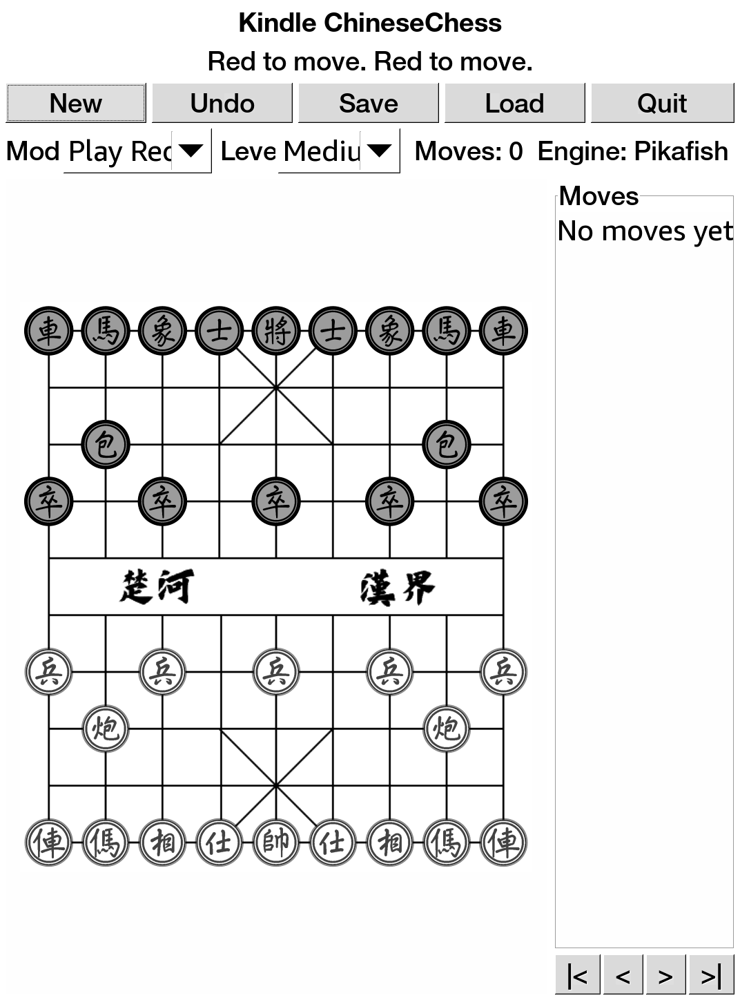

# Exact Chinese Chess

A Kindle-friendly Xiangqi / Chinese Chess app using the same native GTK2/Cairo
and KUAL packaging pattern as Kindle GlChess and Exact Reversi.

## Screenshot



## Features

- Touch-friendly 9x10 Xiangqi board with PNG board and piece artwork.
- Red, Black, two-player, and AI demo modes.
- Optional bundled Pikafish UCI engine support for stronger AI.
- Easy, medium, and hard built-in AI adapted from the GPL-3.0 XMuli
  ChineseChess project as fallback.
- Undo, save, and load.
- KUAL extension package with bundled ARM runtime libraries.

## Pikafish

The release package can include a Kindle ARMv7 hard-float build of Pikafish for
stronger AI play. If Pikafish is unavailable or fails to start, the app falls
back to the embedded AI automatically.

For maintainers building from source:

```bash
git submodule update --init --recursive
./package_extension.sh
```

Detailed Pikafish ARM build notes are in
[docs/PIKAFISH_ARM32_BUILD.md](docs/PIKAFISH_ARM32_BUILD.md).

### Setting Up The Pikafish Submodule

For this repository, Pikafish is intended to live as a pinned Git submodule at
`Pikafish/`:

```bash
git submodule add https://github.com/official-pikafish/Pikafish Pikafish
git -C Pikafish checkout 76239d0b06720bfa4588989fd4ac7573e9dbf887
git add .gitmodules Pikafish
```

Future clones should use:

```bash
git clone --recurse-submodules <repo-url>
```

For an existing clone:

```bash
git submodule update --init --recursive
```

## Build

```bash
git submodule update --init --recursive
./docker_rebuild.sh
./build_pikafish.sh
./package_extension.sh
```

The output package is:

```text
release/exact-chinesechess-extension.zip
```

Unzip it at the Kindle USB-storage root so it creates:

```text
/mnt/us/extensions/exact-chinesechess
/mnt/us/documents/shortcut_exactchinesechess.sh
```

Then launch from KUAL:

```text
KUAL -> Exact Chinese Chess -> Launch
```

## License And Provenance

Rules and built-in AI reference: XMuli ChineseChess, GPL-3.0-or-later,
<https://github.com/XMuli/ChineseChess>.

Artwork: Augus1217 Chinese-Chess, MIT per source project metadata,
<https://github.com/Augus1217/Chinese-Chess>.

Optional engine: Pikafish, GPLv3,
<https://github.com/official-pikafish/Pikafish>. When the release zip bundles
Pikafish, `LICENSES/PIKAFISH-SOURCE.txt` records the exact upstream commit and
build/source details.
